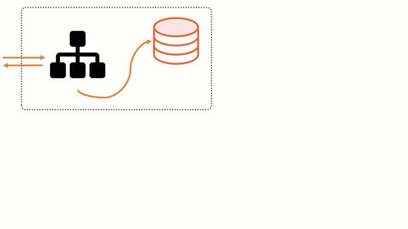
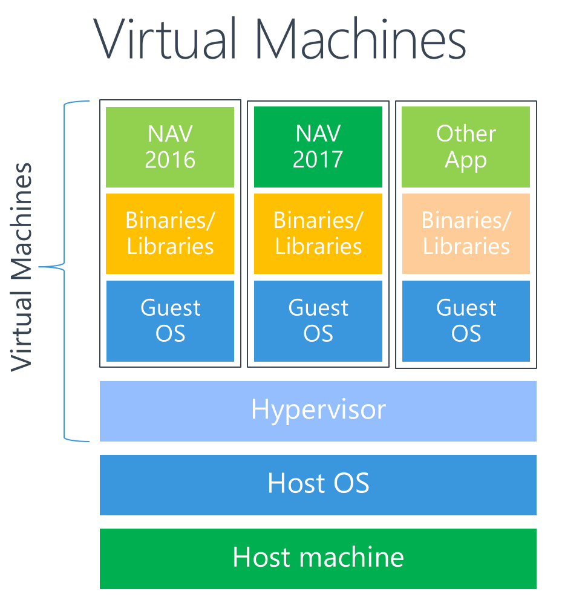
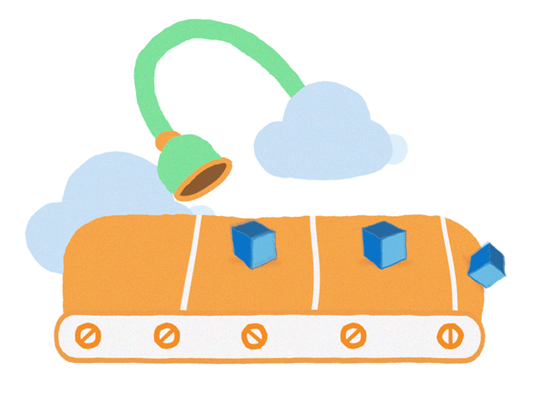

export { default as theme } from './components/Theme'

import { Invert, Split, FullScreenCode, Horizontal} from 'mdx-deck/layouts'
import {Image,Notes,Appear} from 'mdx-deck'
import Demo from './components/Demo'
import Intro from './components/Intro'
import About from './components/About';
import FarmerConnect from './components/FarmerConnect';
import Slides from './components/Slides'

# Built with [MDX][]
[MDX]: https://github.com/mdx-js/mdx

---

```jsx
<button>code example</button>
```

```notes
- These are speaker notes
- And they won't be rendered in your slide
```

---

## Getting Started

1. `npm i -D mdx-deck`
2. Write some markdown and JSX
3. Present

---

```jsx
class extends React.Component {
  render () {
    return (
      <React.Fragment>
        <h1>Indented code</h1>
      </React.Fragment>
    )
  }
}
```
---
> “Blockquotes are essential to any good presentation”

– Anonymous

<Notes>
  <ul>
    <li>Speaker notes can also be</li>
    <li>Written in JSX</li>
  </ul>
</Notes>

---
### Appear

<ul>
  <Appear>
    <li>One</li>
    <li>Two</li>
    <li>Three</li>
    <li>Four</li>
  </Appear>
</ul>

---

<Image
  src='https://source.unsplash.com/random/768x2048'
  size='stretch'
/>

```notes
Testing object fit
```

---

# About Me

<p style={{}}>Hello</p>

---

export default Invert

# Invert Layout

---

<Image src='https://images.unsplash.com/photo-1462331940025-496dfbfc7564?w=2048&q=20' />

---


Inline image

---
export default Invert

# Get started :sunglasses:
[GitHub](https://github.com/jxnblk/mdx-deck)

---

Prop | Type | Description
---|---|---
`width` | number, string, or array | sets element width
`color` | string | sets foreground color
`bg` | string | sets background color

---


export default Split


<Demo/>

---


export default Horizontal


### Horizontal Layout




---
```jsx
<CodeSnippet />
```
---

export default Split

<Slides.AboutContainer />


---

<Slides.ButWhy />

---
export default Split

# VMs vs Containers


---

# Dustin Content

---

# Applying what we learned

---

# Old Apps Exit Strategy

---

# Assisted Micro-Service Strategy

---

# Managing Micro-Services with Pipelines

---

# Microservices
### Any language, any dev, just need to know input/output

---


---

<Intro/>

---

<About/>

---

<!-- # How we are using Docker Containers -->


## DockerCon 18


---


<FarmerConnect/>

## Farmer Connect

---
export default Split


<Demo/>


---

export default Horizontal


#### The Bridge



---


## Automating Mobile 


---


## Evolving Architecture

---

# Lessons learned

---

# Security


---

# Cattle vs Present

---

# Independent and testable


---

# Couldn't dev on laptop/wireless issues (Hyper-V) (Windows)

---

# Certificate Stuff

---

# Server vs Serverless


---

# Fargate has limitation on tasks

---

# Pipeline first, repository, TFS to GitHub

---

# Current Setup

---

# Take Aways

---
# Q & A 

--- 

# Resrouces


---

# The end