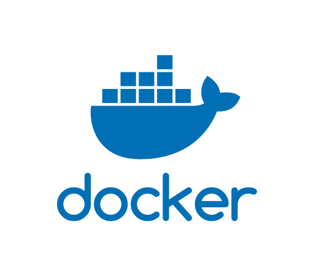

export { default as theme } from './components/Theme'

import { Invert, Split, FullScreenCode, Horizontal} from 'mdx-deck/layouts'
import {Image,Notes,Appear} from 'mdx-deck'
import Demo from './components/Demo'
import Intro from './components/Intro'
import About from './components/About';
import FarmerConnect from './components/FarmerConnect';
import Kandra from './components/Kandra'
import Dustin from './components/Dustin'
import Derick from './components/Derick'
import Ian from './components/Ian'
import Bryan from './components/Bryan'

export default Invert;

---

<Kandra.MovingContainers />

---

<Kandra.ButWhy />

---
export default Split

<Kandra.VMvsContainers />

---

<Dustin.Intro />

---

<Dustin.FargateSlide />

---

<Dustin.RancherGraph />

---

<Dustin.RancherUI />

---

<Dustin.DockerKey />

---

<Dustin.DockerEE />

---

<Derick.ExitStrategy />

---

<Derick.WhatWeLearned />

---

## Pipeline Demo

---

<Derick.Pipeline />

---

<Intro/>

---

<About/>

---

<!-- # How we are using Docker Containers -->

## DockerCon 18

---

<FarmerConnect/>

## Farmer Connect

---
export default Split

<Demo/>

---

export default Horizontal

<Bryan.FireBase />

# E2E

<Bryan.ECS />

---

<Bryan.AutomatingMobile />

## Automating Mobile 

---

<Bryan.EvolvingArch />

## Evolving Architecture

---

<Bryan.End />

---

# BOM Portal

---

<Ian.BOMUI/>

---

<Ian.BOMRecipies />

---

## Where Did We Come From?

---

<Ian.OldArc />

---

<Ian.NewArc />

---

<Ian.LessonLearned />

---

<Ian.PhillyArc />

---

<Ian.Marty />

---

## Resources

##### Play With Docker [PWD][]
[PWD]: https://training.play-with-docker.com
##### Modernizing .NET Apps for Developers by Elton Stoneman: [ELS][]
[ELS]: https://www.youtube.com/watch?v=gaJ9PzihAYw&list=PLkA60AVN3hh88hW4dJXMFIGmTQ4iDBVBp
##### 5 Patterns for Success for Application Transformation : [PEL][]
[PEL]: https://www.slideshare.net/Docker/5-patterns-for-success-for-application-transformation
##### Open Source Project [OPS][]
[OPS]: https://www.docker.com/community/open-source
##### Docker Documentation [DDD][]
[DDD]: https://docs.docker.com/
##### Docker SlideShare: [DSS][]
[DSS]: https://www.slideshare.net/Docker/presentations
##### WTF is A Container: [TCC][]
[TCC]: https://techcrunch.com/2016/10/16/wtf-is-a-container/

---

# Q & A